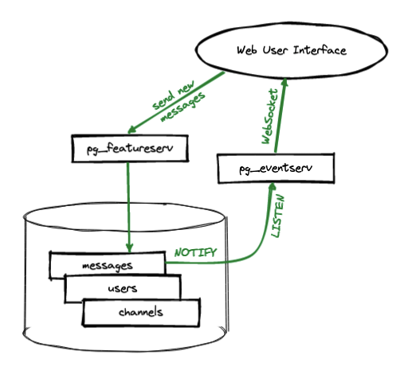

# Chat Server Example

A chat server is a standard demonstration of WebSockets, and for this example we will make use of the database backend to keep a history of all chat messages in a neatly normalized data model.

## Tables

* `users` contains a unique set of chat user names
* `channels` contains a unique set of channel names
* `messages` contains all the chat messages ever sent

## Functions

In order to create a "live" data model, where changes to the underlying data propogate events out to clients, we use two server-side functions (see [chat.sql](chat.sql).

* `postgisftw.message_send(username, channel, message)` is the function used to add new messages to the system. It adds new normalized rows to the `users`, `channels` and `messages` data tables.
* `chat.message_broadcast()` is a trigger function on the `messages` table that is fired on new inserts. It collects the data in the new insert and builds a JSON payload, then sends that payload out on the appropriate channel using `NOTIFY`.

## Services

The example uses two services:

* [pg_featureserv](https://github.com/CrunchyData/pg_featureserv) publishes a function `postgisftw.message_send()` so that the web clients can hit it with a GET request to send in the new messages.
* [pg_eventserv](https://github.com/CrunchyData/pg_eventserv) publishes the contents of the LISTEN/NOTIFY bus using WebSockets, where the client can connect to get a real-time feed of all notifications.

